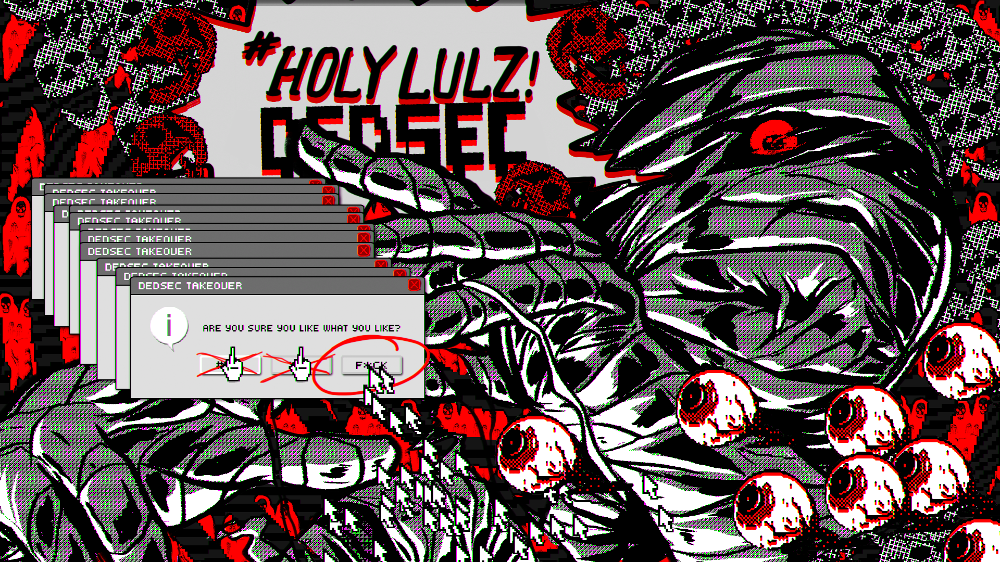

# Prologue - owm's Edits

> This is Prologue, a simple, single page responsive site template from [HTML5 UP](https://html5up.net/prologue), now available as a blog-aware Jekyll theme from [Chris Bobbe](https://chrisbobbe.github.io). It features a clean, minimalistic design and a sticky sidebar with navigation-linked scrolling.

My edits and changes to this theme. See [original project](https://github.com/chrisbobbe/jekyll-theme-prologue) for documentation.

## List of Changes
- Add syntax highlighting with Rouge ("Trac" theme)

